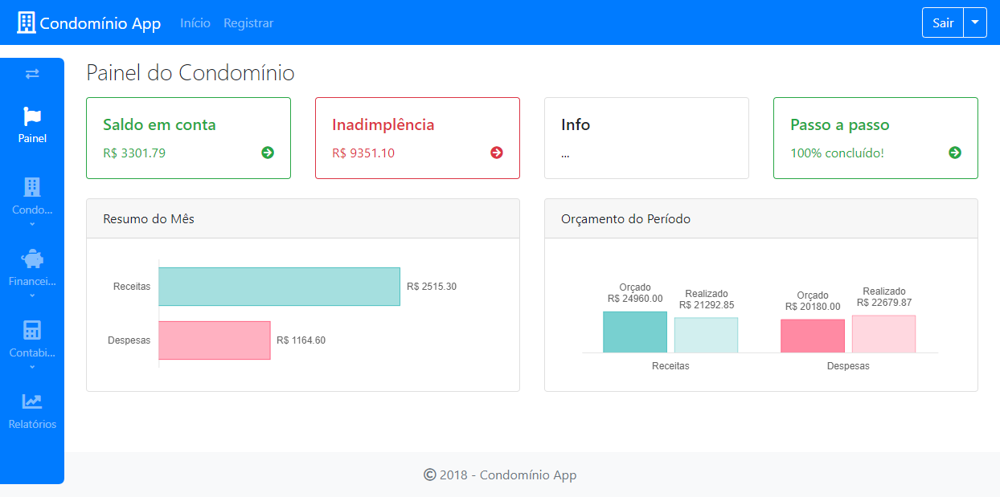

# Sistema de Gestão para Condomínios



Sistema para gerenciamento de condomínios com recursos de cadastro de imóveis e moradores, contas a receber, contas bancárias e suas movimentações de entrada e saída, controle orçamentário e contábil.

Neste arquivo você encontrará instruções para instalação, imagens demonstrativas e também tecnologias utilizadas nesta aplicação. Para um conhecimento mais aprofundado leia Trabalho de Conclusão de Curso, na íntegra, no [Repositório Institucional da UFU](https://repositorio.ufu.br/handle/123456789/23437).

## Primeiros Passos

Siga estas instruções para ter uma cópia do projeto funcionando em seu computador.

### Pré-requisitos

O que você precisará:

```
IDE Eclipse
Spring Tools for Eclipse
JDK
Maven
MySQL
```

### Instalando

Siga os passos a seguir para rodar esta aplicação em seu computador.

#### Banco de Dados

Crie o banco de dados no MySQL usando o seu cliente SQL favorito e execute o arquivo [schema.sql](src/main/resources/schema.sql).

#### Variáveis de ambiente

Crie novas variáveis de ambiente para que a aplicação possa se conectar ao seu banco de dados:

```
No Windows, vá em Painel de Controle → Sistema e Segurança → Sistema → Configurações avançadas do sistema → Variáveis de Ambiente → Novo
```

Insira as 3 variáveis de ambiente abaixo (substitua os valores entre << >> pelos dados da sua base):

```
SPRING_DATASOURCE_URL = jdbc:mysql://localhost:3306/<<nome_da_sua_base>>?createDatabaseIfNotExist=false&useSSL=false
SPRING_DATASOURCE_USERNAME = <<usuario_do_banco>>
SPRING_DATASOURCE_PASSWORD = <<senha_do_banco>>
```

> Caso você tenha criado um banco de dados com o nome "condominio" e o usuário e senha do seu banco de dados forem "root", você não precisa criar nenhuma variável de ambiente. Há outras variáveis que podem ser definidas, consulte o arquivo [application.properties](src/main/resources/application.properties) para detalhes.

#### Obtendo uma cópia

Faça o download, use uma ferramente Git ou a própria IDE Eclipse para clonar este repositório:

```
No Eclipse, vá em File → Import → Git → Projects from Git → Clone URI.
Informe a URI e clique em Next → Next → Next → Import as general project → Next → Finish.
No Eclipse, com o botão direito sobre o projeto, vá em Configure → Convert to Maven Project
```

### Executando

Execute o projeto como uma aplicação Spring Boot:

```
No Eclipse, com o botão direito sobre o projeto, vá em Run As → Spring Boot App
```

O servidor estará pronto quando a mensagem abaixo for exibida no console:

```
app.condominio.CondominioApplication     : Started CondominioApplication in X.XXX seconds (JVM running for X.XXX)
```

## Demonstração

#### Acessando a aplicação pela primeira vez

Acesse localhost:8080 para usar a aplicação.

> Caso queira utilizar outra porta, crie uma variável de ambiente com o nome PORT e com o número da porta desejada como valor).

Para acessar a área privada da aplicação é preciso ter um usuário:

```
Clique em Registrar
Informe dados fictícios para criar um usuário e clique em Registrar
```

Acesse a área privada:

```
Clique em Entrar
Informe os dados do usuário criado e clique em Entrar
```

#### Utilização

Use o menu lateral para navegação:

```
Vá em Condomínio → Cadastro e crie um condomínio
Vá em Condomínio → Blocos e crie um ou mais blocos/edifícios
Vá em Condomínio → Moradias e crie alguns imóveis
Vá em Condomínio → Condôminos e crie alguns moradores, podendo relacioná-los a imóveis
Vá em Financeiro → Contas e crie as contas bancárias/carteira do condomínio
Vá em Financeiro → Cobranças e cadastre as mensalidades devidas pelos condôminos
Vá em Contabilidade → Categorias e crie uma hierarquia de receitas e despesas
Vá em Contabilidade → Períodos e cadastre um período de gestão
Vá em Contabilidade → Orçamento e crie um orçamento
Vá em Contabilidade → Movimentos e registre operações de entrada e saída das contas
Vá em Relatórios para visualizar diveras informações gerencias sobre os dados do condomínio
```

#### Capturas de tela

[Demo #1](demo/demo_1.png) - [Demo #2](demo/demo_2.png) - [Demo #3](demo/demo_3.png) - [Demo #4](demo/demo_4.png) - [Demo #5](demo/demo_5.png) - [Demo #6](demo/demo_6.png) - [Demo #7](demo/demo_7.png) - [Demo #8](demo/demo_8.png) - [Demo #9](demo/demo_9.png) 

## Deployment

Distribua este projeto como um arquivo *.war para rodá-lo em um servidor Tomcat:

```
No Eclipse, com o botão direito sobre o projeto, vá em Export → WAR file
```

## Tecnologias utilizadas

* [Spring](https://spring.io/) - O framework back-end utilizado
* [Spring Boot](https://spring.io/projects/spring-boot) - Framwork para inicialização
* [Spring Data JPA](https://spring.io/projects/spring-data-jpa) - Framework para persistência de dados
* [Spring Security](https://spring.io/projects/spring-security) - Framework para autenticação de usuários
* [Hibernate](http://hibernate.org/) - Framework para persistência de dados
* [Thymeleaf](https://www.thymeleaf.org/) - O framework front-end utilizado
* [MySQL](https://www.mysql.com/) - O SGBD adotado
* [Maven](https://maven.apache.org/) - Gerenciador de dependências
* [Bootstrap](https://getbootstrap.com/) - Biblioteca CSS
* [jQuery](https://jquery.com/) - Biblioteca JavaScript
* [Chart.js](https://www.chartjs.org/) - Bibliotea JavaScript para gráficos
* [Font Awesome](https://fontawesome.com/) - Biblioteca de ícones

## Autor

Steffan Martins Alves - [LinkedIn](https://www.linkedin.com/in/steffanmartins/)

## Licença

Este projeto está licenciado sob a GNU Affero General Public License v3.0 - leia [LICENSE.md](LICENSE.md) para mais detalhes.
